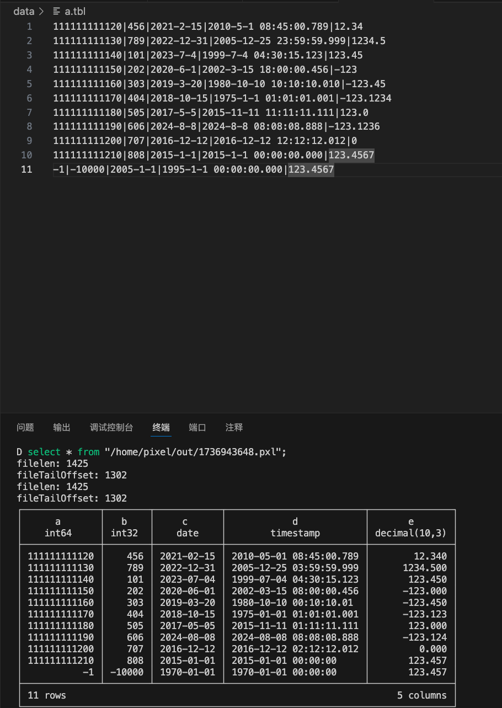

# 实验报告

## 基本情况

完成了Date、Timestamp、Decimal三个类型的实现，同时找到了一些bugs。因为完成得比较早，所以提交了一个tips的PR。

## 补全过程

### Date

Date类的底层存储是int，除了字符串的解析，别的部分基本上可以照抄Integer的代码。（中间注意一下把writeLong改成writeInt）当然，由于默认开启了runlength encoding，实际上并不会走到这里。

字符串解析需要注意是到1970-01-01的天数，选择用`tm`结构体的mktime函数，得到小时再除以24来计算。

### Timestamp

Timestamp类的底层存储是long，所以可以参考writeLong的代码。由于目前版本的精度控制还有一些问题，传入的精度是0，注释里精度是3，但实际上duckdb读取的时候精度是6.解析时大概是`2020-01-01 00:00:00.000000`的精度来转成long。

当框架更完善之后，理论上需要把精度控制加上，参考java版本的ROUND等方法。

### Decimal

这里的问题比较多，因为cpp没有java版本的BigDecimal，所以需要手动来实现。这里比较麻烦，要考虑正负数，scale，还有四舍五入的实现等。

由于目前的框架，当precision小于10的时候，reader的显示会有问题。很不幸当时测试的时候遇到了。当时并未确认是reader还是writer的问题，所以写了两个版本的writer，分别对应java版本的decimal和cpp版本的带buffer的版本。实际上两个效果都是一样的，

## bugs

个人认为lab的难度其实并不大，单纯补全代码来说，由于代码都比较类似，甚至copilot就能基本完成。所花费时间较多的是知道自己要干什么，在哪里补充代码。

此外，由于框架完成度还不算特别高，导致完成实验的过程中大部分时间在debug。

遇到的问题有：
1. 有一个函数指针的问题，需要把long*改成int*。（新版master已经修复）
2. debug版本的ub会直接报错，会导致integer类型的负数无法正确写入。（由于在release中不会报错，所以尚未修复，需要注意的是，这里可能是会有问题的。）
3. pdf中说的-n参数指定最大行数的表述大概有一些问题，因为目前的cli并不会写多个文件，当行数超过-n时并不会默认开一个新的，而是会生成一个无法读取的文件，并且cli不会报错。
4. reader的异步读取对future没有get()，所以当数据较多时会出错。（新版已修复）
5. 由于没有测试文件，当自己手写测试文件习惯性文末加空行时，会导致`segmentation fault`，或者是`runtime error`。（这个问题比较难debug，因为不会报错，只能通过gdb来查看）目前尚未对此进行check。
6. timestamp的精度控制，writer和reader的精度不一致。
7. 补充框架中的.h的函数，有一个漏了const，导致虚函数没有override，编译器也不会报错。它所导致的问题是writer可能进行了压缩，但reader没有解压，导致读取的数据不正确。这个问题影响很大，而且真的很难找到。这也就说明了，虚函数全部加上override是一个好习惯。
8. decimal的reader有问题，当precision低于10的时候，只能正确显示一半的（奇数）数据。
9. type的swich那里，大概是为了编译通过，没有写全，导致无法直接进行类型转换。这里理论上可能是需要我们来补充的，但pdf中没直接提到，有可能大家不会发现。
10. vector在构造的时候没分配空间，写入会出错。（由于之前没有writer所以不影响，但当开始writer的时候也很难发现这里需要修改，会默认当作框架写好的，就很难找）

## 实验结果

实现了日期，timestamp，decimal的正确写入。decimal能正常四舍五入，也能有负数。

## 总结和建议

lab很好的锻炼了debug的能力，但如果可以有一些更详细的代码讲解，更明确的任务要求，更完善的代码框架，以及正确的和适当的注释，会让lab难度合理很多。个人觉得单单补完几个writer其实工作量并不大，更大的问题在于我们可能并不那么明确知道任务一二三是要干什么，同时要花费大量的时间来debug。

此外，虽然我还不知道duckdb的extension能否像pg的一样比较好地做到解耦合，但可能有更好的方式来使用duckdb。对于大多数同学，编译duckdb其实很费时费力的（核开多了就炸了）。就算第一次编好之后，修改之后再编译也需要一段时间来链接。

个人觉得如果能优化一下这里，其实很有利于大家写作业。

此外，如果能有一个官方的测试文件，评测脚本，大家就可以少花很多时间在一些大概是不必要的地方。

